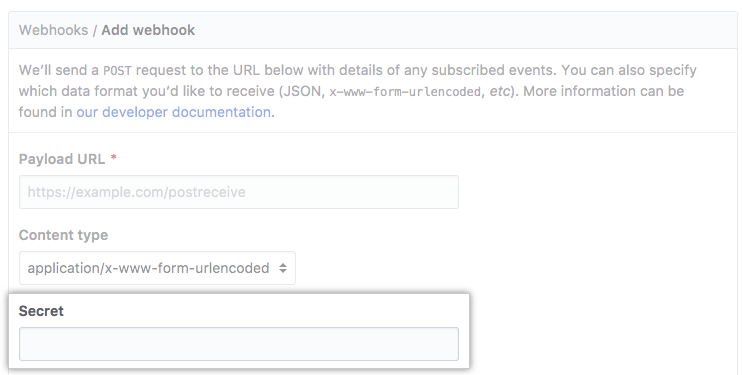
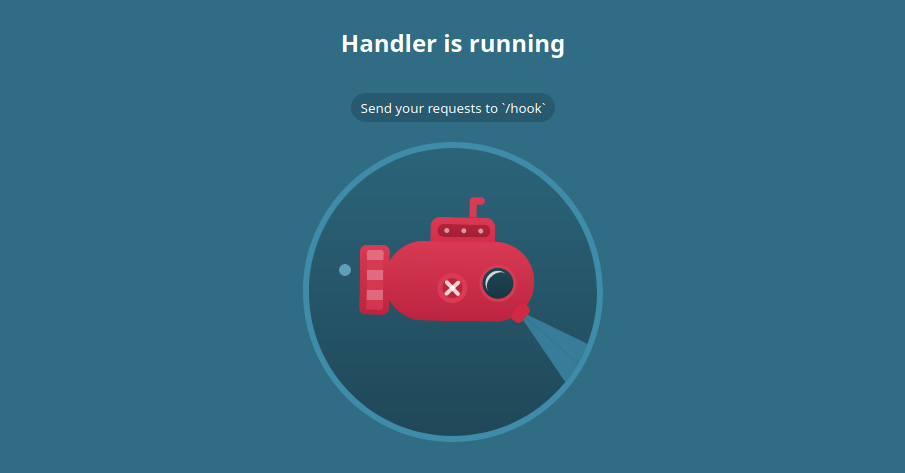

# Webhook Handler

[](https://github.com/hatamiarash7/WebhookHandler/blob/master/LICENSE)   

A Webhook Handler for Github, Gitlab, .... It's just a simple parser and you should extend this project if you need a visualization.

## Configure

You need to set env variables for using webhooks. Create a `.env` like this :

```env
SECRET=changeme

DB_CONNECTION="mongodb://localhost:27017/webhook"

PROVIDER=github

# Github:  X-Hub-Signature
# Gitlab:  X-Gitlab-Token
# Gogs:    X-Gogs-Signature
# Gitea:   HTTP_X_GITEA_SIGNATURE
SIGNATURE="X-Hub-Signature"

LOG_LEVEL=info

TRUST_KEY=changeme
```

Use `SECRET` value in github settings :



**Important** : You should select `application/json` for content type.

### Trusted platforms

For use with trusted platforms or offline/local usage, you can pass a `trusted` query to webhook URL. For example :

```txt
http://<domain>/gitlab?trusted=1234
```

Now, the program will ignore verification and catch anything received.

❕ This query value should equal to `TRUST_KEY` variable from your `env.` file.

## Run

```bash
npm install
node hook.js
```

Or use docker

```bash
docker pull hatamiarash7/webhook
docker run -d
    -p 3000:3000
    -e SECRET='changeme'
    -e DB_CONNECTION='mongodb://localhost:27017/webhook'
    -e PROVIDER='github'
    -e SIGNATURE='X-Hub-Signature'
    -e LOG_LEVEL='debug'
    -e TRUST_KEY='changeme'
    hatamiarash7/webhook
```



## Log

We have 6 level for logging

- trace
- debug
- info
- warn
- error
- fatal

Set any level in `env.` file :

```env
LOG_LEVEL=info
```

## To-Do

- [x] Connect to DB
- [ ] Test with git platforms
  - [x] Github
  - [ ] Gitlab
  - [ ] Gitea
  - [ ] Gogs
- [x] Configure a logger
- [ ] Add another crypto methods
- [ ] Add a simple dashboard

---

## Support

[](https://en.cryptobadges.io/donate/3GhT2ABRuHuXGNzP6DH5KvLZRTXCBKkx2y) [](https://en.cryptobadges.io/donate/0x4832fd8e2cfade141dc4873cc00cf77de604edde)

[](https://ko-fi.com/D1D1WGU9)

<div><a href="https://payping.ir/@hatamiarash7"></a></div>

## Contributing

Don't be shy to be a contributor 😉

1. Fork it !
2. Create your feature branch : `git checkout -b my-new-feature`
3. Commit your changes : `git commit -am 'Add some feature'`
4. Push to the branch : `git push origin my-new-feature`
5. Submit a pull request

## Issues

Each project may have many problems. Contributing to the better development of this project by reporting them.
